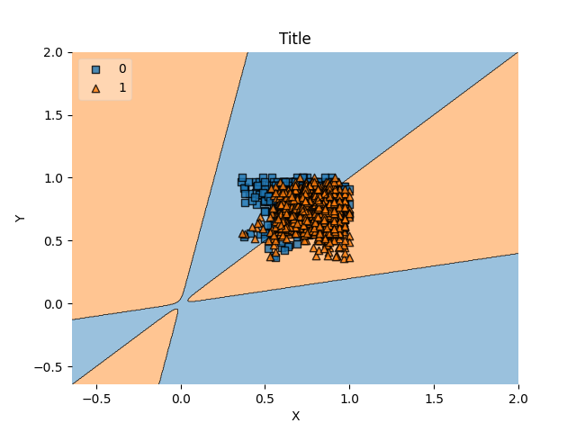
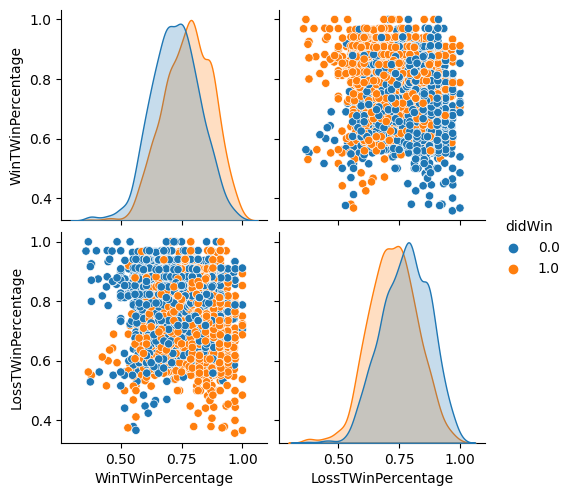

# NCAA March Madness bracket 2021 challenge

# How it works
Originally it used the page rank algorithm to rank each indivisual team
in each league compared to the league. It also ranked each league and added in
winning percentage for the league vs other leagues and teams vs other teams in the
league. Also winning percentage for the last 10 games.
I then used a neural network but switched to a svm. The page ranked seemed
useless to the svm and when I viewed how good it was by using seaborn it seemed
the page rank was indeed useless so I removed them.

# Note
The pagerank.py file is a link to https://github.com/Monksc/EnglishPremierLeaguePredictions/blob/main/pagerank.py

# To Download data
```
kaggle competitions download -c ncaam-march-mania-2021
```


# Results for 2021
```
FIRST ROUND  64
              TEAM A  PROB    PROB  TEAM B                   Probability of Team A winning
                       of      of
               getting here  getting here
             Gonzaga  1.00 vs 1.00  Norfolk St                          0.98
            Oklahoma  1.00 vs 1.00  Missouri                            0.50
           Creighton  1.00 vs 1.00  UC Santa Barbara                    0.53
            Virginia  1.00 vs 1.00  Ohio                                0.67
                 USC  1.00 vs 1.00  Wichita St                          0.52
              Kansas  1.00 vs 1.00  E Washington                        0.79
              Oregon  1.00 vs 1.00  VCU                                 0.65
                Iowa  1.00 vs 1.00  Grand Canyon                        0.83
            Michigan  1.00 vs 1.00  Mt St Mary's                        0.89
                 LSU  1.00 vs 1.00  St Bonaventure                      0.47
            Colorado  1.00 vs 1.00  Georgetown                          0.69
          Florida St  1.00 vs 1.00  UNC Greensboro                      0.60
                 BYU  1.00 vs 1.00  UCLA                                0.70
               Texas  1.00 vs 1.00  Abilene Chr                         0.83
         Connecticut  1.00 vs 1.00  Maryland                            0.62
             Alabama  1.00 vs 1.00  Iona                                0.76
              Baylor  1.00 vs 1.00  Hartford                            0.91
      North Carolina  1.00 vs 1.00  Wisconsin                           0.57
           Villanova  1.00 vs 1.00  Winthrop                            0.44
              Purdue  1.00 vs 1.00  North Texas                         0.65
          Texas Tech  1.00 vs 1.00  Utah St                             0.57
            Arkansas  1.00 vs 1.00  Colgate                             0.47
             Florida  1.00 vs 1.00  Virginia Tech                       0.39
             Ohio St  1.00 vs 1.00  Oral Roberts                        0.84
            Illinois  1.00 vs 1.00  Drexel                              0.85
      Loyola-Chicago  1.00 vs 1.00  Georgia                             0.71
           Tennessee  1.00 vs 1.00  Oregon St                           0.65
         Oklahoma St  1.00 vs 1.00  Liberty                             0.73
        UC San Diego  1.00 vs 1.00  Syracuse                            0.18
       West Virginia  1.00 vs 1.00  Morehead St                         0.67
             Clemson  1.00 vs 1.00  Rutgers                             0.62
             Houston  1.00 vs 1.00  Cleveland St                        0.81

PLAYING ROUND:  32
             Gonzaga  0.98 vs 0.50  Missouri                            0.92
           Creighton  0.53 vs 0.67  Virginia                            0.49
                 USC  0.52 vs 0.79  Kansas                              0.51
              Oregon  0.65 vs 0.83  Iowa                                0.50
            Michigan  0.89 vs 0.53  St Bonaventure                      0.69
            Colorado  0.69 vs 0.60  Florida St                          0.47
                 BYU  0.70 vs 0.83  Texas                               0.51
         Connecticut  0.62 vs 0.76  Alabama                             0.34
              Baylor  0.91 vs 0.57  North Carolina                      0.84
            Winthrop  0.56 vs 0.65  Purdue                              0.53
          Texas Tech  0.57 vs 0.53  Colgate                             0.30
       Virginia Tech  0.61 vs 0.84  Ohio St                             0.53
            Illinois  0.85 vs 0.71  Loyola-Chicago                      0.64
           Tennessee  0.65 vs 0.73  Oklahoma St                         0.45
            Syracuse  0.82 vs 0.67  West Virginia                       0.43
             Clemson  0.62 vs 0.81  Houston                             0.32

PLAYING ROUND:  16
             Gonzaga  0.90 vs 0.34  Virginia                            0.88
              Kansas  0.38 vs 0.41  Iowa                                0.45
            Michigan  0.61 vs 0.32  Colorado                            0.69
               Texas  0.40 vs 0.50  Alabama                             0.46
              Baylor  0.77 vs 0.31  Purdue                              0.80
             Colgate  0.37 vs 0.40  Ohio St                             0.67
            Illinois  0.55 vs 0.40  Oklahoma St                         0.60
       West Virginia  0.38 vs 0.55  Houston                             0.33

PLAYING ROUND:  8
             Gonzaga  0.79 vs 0.23  Iowa                                0.84
            Michigan  0.42 vs 0.27  Alabama                             0.56
              Baylor  0.61 vs 0.25  Colgate                             0.69
            Illinois  0.33 vs 0.37  Houston                             0.48

PLAYING ROUND:  4
             Gonzaga  0.66 vs 0.23  Michigan                            0.76
              Baylor  0.42 vs 0.19  Houston                             0.66

PLAYING ROUND:  2
             Gonzaga  0.50 vs 0.28  Baylor                              0.64

PLAYING ROUND:  1

Winner:  Gonzaga 0.319
```


# Images to view the data

Decision Boundary



Correlation Graph of Inputs



Correlation Graph of Inputs Of Orginal Data


# Images to view the data

Decision Boundary


Correlation Graph of Inputs


Correlation Graph of Inputs Of Orginal Data


# Results for 2022
```
FIRST ROUND  64
             Gonzaga  1.00 vs 1.00  Georgia St                          0.84
            Boise St  1.00 vs 1.00  Memphis                             0.66
         Connecticut  1.00 vs 1.00  New Mexico St                       0.63
            Arkansas  1.00 vs 1.00  Vermont                             0.72
             Alabama  1.00 vs 1.00  Rutgers                             0.55
          Texas Tech  1.00 vs 1.00  Montana St                          0.78
         Michigan St  1.00 vs 1.00  Davidson                            0.37
                Duke  1.00 vs 1.00  CS Fullerton                        0.85
              Baylor  1.00 vs 1.00  Norfolk St                          0.92
      North Carolina  1.00 vs 1.00  Marquette                           0.62
        St Mary's CA  1.00 vs 1.00  Wyoming                             0.43
                UCLA  1.00 vs 1.00  Akron                               0.73
               Texas  1.00 vs 1.00  Virginia Tech                       0.64
              Purdue  1.00 vs 1.00  Yale                                0.90
           Murray St  1.00 vs 1.00  San Francisco                       0.56
            Kentucky  1.00 vs 1.00  St Peter's                          0.86
             Arizona  1.00 vs 1.00  Wright St                           0.92
          Seton Hall  1.00 vs 1.00  TCU                                 0.51
             Houston  1.00 vs 1.00  UAB                                 0.69
            Illinois  1.00 vs 1.00  Chattanooga                         0.57
         Colorado St  1.00 vs 1.00  Michigan                            0.75
           Tennessee  1.00 vs 1.00  Longwood                            0.85
             Ohio St  1.00 vs 1.00  Loyola-Chicago                      0.52
           Villanova  1.00 vs 1.00  Delaware                            0.83
              Kansas  1.00 vs 1.00  TX Southern                         0.97
        San Diego St  1.00 vs 1.00  Creighton                           0.55
                Iowa  1.00 vs 1.00  Richmond                            0.72
          Providence  1.00 vs 1.00  S Dakota St                         0.68
                 LSU  1.00 vs 1.00  Iowa St                             0.52
           Wisconsin  1.00 vs 1.00  Colgate                             0.88
                 USC  1.00 vs 1.00  Miami FL                            0.63
              Auburn  1.00 vs 1.00  Jacksonville St                     0.92

PLAYING ROUND:  32
             Gonzaga  0.84 vs 0.66  Boise St                            0.58
         Connecticut  0.63 vs 0.72  Arkansas                            0.41
             Alabama  0.55 vs 0.78  Texas Tech                          0.28
            Davidson  0.63 vs 0.85  Duke                                0.44
              Baylor  0.92 vs 0.62  North Carolina                      0.75
             Wyoming  0.57 vs 0.73  UCLA                                0.46
               Texas  0.64 vs 0.90  Purdue                              0.39
           Murray St  0.56 vs 0.86  Kentucky                            0.36
             Arizona  0.92 vs 0.51  Seton Hall                          0.72
             Houston  0.69 vs 0.57  Illinois                            0.62
         Colorado St  0.75 vs 0.85  Tennessee                           0.42
             Ohio St  0.52 vs 0.83  Villanova                           0.32
              Kansas  0.97 vs 0.55  San Diego St                        0.75
                Iowa  0.72 vs 0.68  Providence                          0.39
                 LSU  0.52 vs 0.88  Wisconsin                           0.38
                 USC  0.63 vs 0.92  Auburn                              0.33

PLAYING ROUND:  16
             Gonzaga  0.49 vs 0.43  Arkansas                            0.52
          Texas Tech  0.57 vs 0.48  Duke                                0.53
              Baylor  0.70 vs 0.40  UCLA                                0.71
              Purdue  0.55 vs 0.55  Kentucky                            0.45
             Arizona  0.67 vs 0.43  Houston                             0.58
           Tennessee  0.49 vs 0.56  Villanova                           0.56
              Kansas  0.73 vs 0.41  Providence                          0.58
           Wisconsin  0.55 vs 0.62  Auburn                              0.37

PLAYING ROUND:  8
             Gonzaga  0.25 vs 0.30  Texas Tech                          0.50
              Baylor  0.50 vs 0.31  Kentucky                            0.59
             Arizona  0.39 vs 0.27  Tennessee                           0.54
              Kansas  0.42 vs 0.39  Auburn                              0.54

PLAYING ROUND:  4
          Texas Tech  0.15 vs 0.29  Baylor                              0.37
             Arizona  0.21 vs 0.23  Kansas                              0.45

PLAYING ROUND:  2
              Baylor  0.18 vs 0.12  Kansas                              0.48

PLAYING ROUND:  1

Winner:  Baylor 0.088
```
